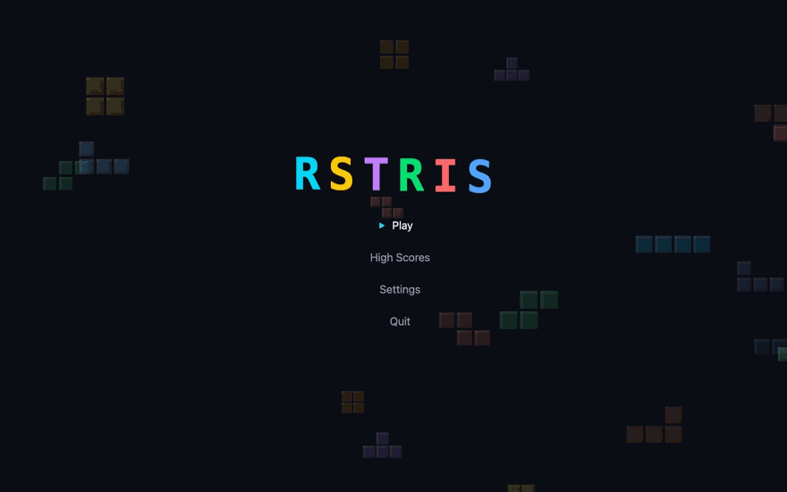
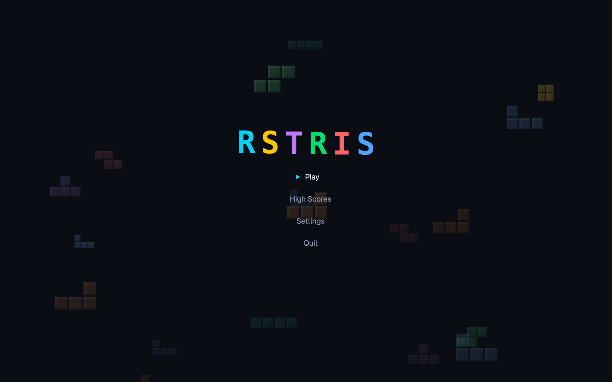
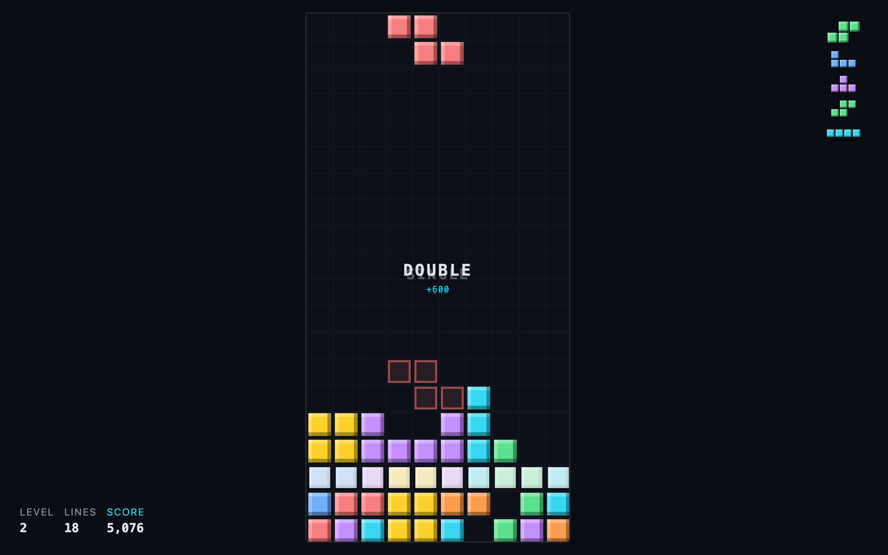
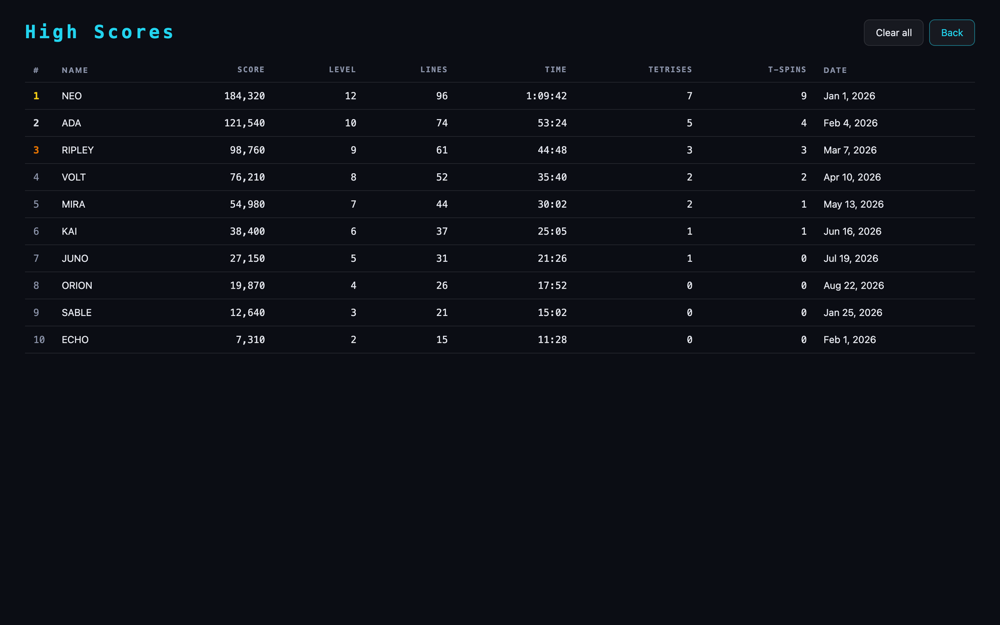
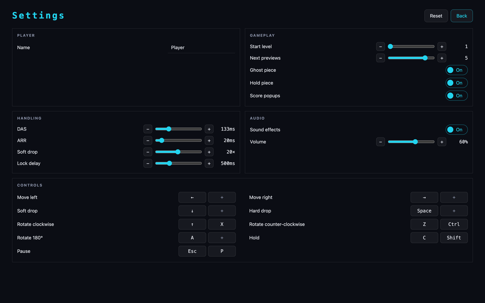

<div align="center">

# RSTRIS




<sub>[Watch the full-resolution clip](docs/clips/gameplay.webm)</sub>


&nbsp; [Features](#features) &nbsp;&nbsp; [Controls](#controls) &nbsp;&nbsp; [Scoring](#scoring)

</div>

---

## Screenshots

|                                                                             |                                                                       |
| :-------------------------------------------------------------------------: | :-------------------------------------------------------------------: |
|   <br>**Main menu**   | <br>**In game**  |
| <br>**High scores** | <br>**Settings** |

## Controls

| Action                   | Keys       |
| ------------------------ | ---------- |
| Move                     | ← →        |
| Soft drop                | ↓          |
| Hard drop                | Space      |
| Rotate clockwise         | ↑, X       |
| Rotate counter-clockwise | Z, L Ctrl  |
| Rotate 180°              | A          |
| Hold                     | C, L Shift |
| Pause                    | Esc, P     |


## Install


```sh
git clone https://github.com/fredrir/rstris
cd rstris
bun install
bun tauri build
```

---


[Apache-2.0](LICENSE)  [Contributing](DEVELOPMENT.md)

